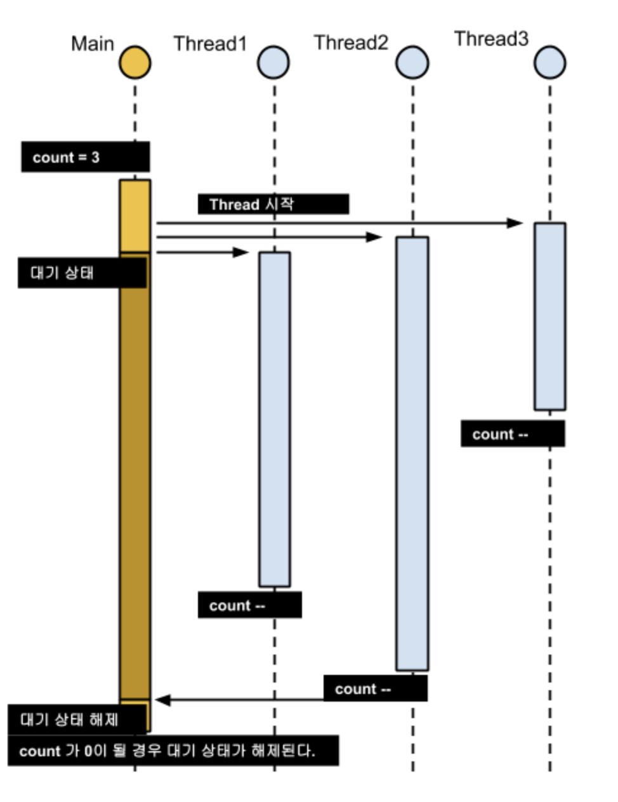
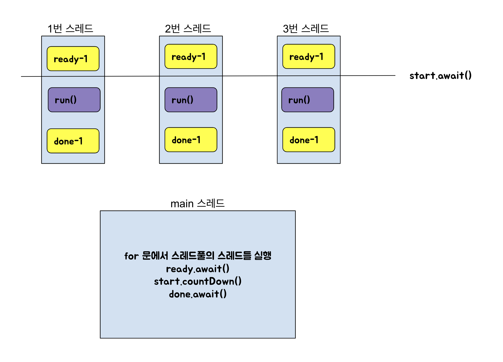

# wait() 과 notify() 보다는 동시성 유틸리티를 애용하라.

 - 공유자원을 다룰 때 사용하는 명령어들이다.
 - wait() : `락을 가진` 스레드에 wait() 을 하면, 락을 놓고 대기 자원으로 간다.
 - notify() : `대기 자원` 의 스레드들 중 하나를 실행 준비 상태로 깨운다.
 - notifyAll() : `대기중인 모든 스레드` 를 실행 준비 상태로 깨운다.
 
 이 메서드들을 이용하여 올바른 동시성 프로그래밍을 하기는 매우 어렵다.
 하지만 고수준 동시성 유틸리티를 사용하면, 이 메서드들을 사용하지 않아도 된다.
 
## 고수준의 동시성 유틸리티
1. 실행자 프레임워크 (Executor)
1. 동시성 컬렉션
1. 동기화 장치 (synchronizer)

<br>
<br>

## 동시성 컬렉션
 - java.util.concurrent
 - 자바 표준 컬렉션 인터페이스에 동시성을 추가시킨 버전.
 - BlockingQueue, ConcurrentHashMap, CopyOnWriteArrayList, CopyOnWriteArraySet
 - 이외에도 DelayQueue, Executor, ForkJoinPool, FutureCallable, Callable...
 
 동시성 컬렉션은 내부에서 동기화를 실행한다. (StringBuilder, StringBuffer 차이 기억하시죠 ?)  
 따라서 동시성을 무력화하는 것은 불가능하며, 외부에서 추가로 락을 사용하는 것은 속도를 느리게한다.
 
### 여러 기본동작을 하나의 원자적 동작으로 묶는 *상태 의존적 수정 메서드*
 - 동시성 컬렉션은 동시성을 외부에서 무력화하지 못하므로 추가된 메서드들.
 - 처음에는 동시성 컬렉션들에만 있었으나 유용해서 일반 컬렉션 인터페이스에도 디폴트 메서드로 추가됨.
 
 ```java
package Chapter11.Day81;

import org.junit.jupiter.api.BeforeEach;
import org.junit.jupiter.api.DisplayName;
import org.junit.jupiter.api.Test;

import java.util.Map;
import java.util.concurrent.ConcurrentHashMap;

import static org.assertj.core.api.Assertions.*;

class PutIfAbTest {

    private Map<String, String> map;

    @BeforeEach
    void setUp() {
        map = new ConcurrentHashMap<>();
    }

    @DisplayName("putIfAbsent() 는 주어진 키에 매핑된 값이 없으면 새 값을 집어넣고 null 을 반환한다.")
    @Test
    void putIfAbsentTest() {
        String result = map.putIfAbsent("hi", "hello");

        assertThat(result).isNull();
        assertThat(map).containsEntry("hi", "hello");
    }

    @DisplayName("putIfAbsent() 는 주어진 키에 매핑된 값이 있으면 변경하지 않고 원래값을 반환한다.")
    @Test
    void putIfAbsentTest2() {
        map.put("hi", "hello");
        String result = map.putIfAbsent("hi", "bye");

        assertThat(result).isEqualTo("hello");
        assertThat(map).containsEntry("hi", "hello");
    }

    @DisplayName("computeIfAbsent() 는 value 값으로 함수 객체를 줄 수 있다.")
    @Test
    void computeIfAbsentTest() {
        String result = map.computeIfAbsent("hi", key -> key + ("(mingeor)"));

        assertThat(result).isEqualTo("hi(mingeor)");
        assertThat(map).containsEntry("hi", "hi(mingeor)");
    }

    @DisplayName("getOrDefault() 는 키에 맞는 값을 가져오고 없으면 지정한 디폴트 값을 반환한다. 삽입하지는 않는다.")
    @Test
    void get() {
        map.put("hello", "greeting");

        String result = map.getOrDefault("hi", "default String");
        String result2 = map.getOrDefault("hello", "default String");
        
        assertThat(result).isEqualTo("default String");
        assertThat(result2).isEqualTo("greeting");
    }
}
 ```

#### putIfAbsent 덕분에 스레드 안전 정규화 맵을 쉽게 구현할 수 있다.
 - String.intern() 은 네이티브 메서드이다.
 ```java

 String name = "mingeor";
 
 1. name == "mingeor";
 2. name == new String("mingeor");

 ```
 - JVM 은 1번 식을 `name == new String("mingoer").intern()` 으로 최적화한다.
 ```java
@Test
     void test() {
         String name = "minger";
    
         String newName = new String("minger");
         String intern = newName.intern();
    
         assertThat(name).isNotSameAs(newName);
         assertThat(name).isSameAs(intern);
     }
```
 
 
 - putIfAbsent 을 사용하면 스레드 안전하고 쉽게 만들 수 있다.
 ```java
    private static String intern(String s) {
        String result = map.get(s);
        if (isNull(result)) {
            result = map.putIfAbsent(s, s);
            if (isNull(result)) {
                result = s;
            }
        }
        return result;
    }
 ```


### 동시성 컬렉션은 동기화환 컬렉션을 유산으로 만들었다.
 - 동기화된 컬렉션
    - Collections.synchronizedMap()
        - 이 맵은 필드값으로 자신의 인스턴스인 `mutex` 를 가지고 있다.
        - 모든 매서드의 몸체가 synchronized (mutex) 로 감싸져 있다.
    - HashTable
        - 모든 메서드에 synchronized 키워드가 붙어있다.
        - HashMap 과 비교해서 동기화가 되어있는 차이점이 있다.
        
 - 대응하는 동시성 컬렉션 : ConcurrentHashMap
 
 <br>
 <br>
 <br>
 <br>
 
### 작업이 끝날 때까지 기다리도록 확장된 컬렉션 인터페이스
 - Queue 를 확장한 BlockingQueue
 - BlockingQueue 의 `take()` 는 큐에서 원소를 꺼내는데, 큐가 비었다면 새로운 원소가 추가될때까지 wait() 한다.
 - ThreadPoolExecutor 같은 스레드풀도 내부적으로 BlockingQueue 에서 작업을 꺼내 처리한다.
 
  <br>
  <br>
  <br>
  <br>
 
### 동기화 장치

- CountDownLatch, Semaphore
    - 가장 자주 쓰인다.
- CylicBarrier, Exchanger
    - 상대적으로 덜 쓰인다.
- Phaser
    - 가장 강력하다.

#### CountDownLatch
 - 하나 이상의 스레드가 또 다른 하나 이상의 스레드 작업이 끝날 때 까지 기다리게 한다.
 - 생성자로 int 값을 받는데, 이 값이 CountDownLatch 에서 countDown() 를 몇번 호출할때 까지 기다리는지를 정의한다.
 - 쉽게 말해, a.await() 이 걸리면, a.countDown() 이 위의 Int 값만큼 불러져야 다음 코드를 실행할 수 있다.


##### 동작을 동시에 시작하여 끝날 떄까지의 시간을 재는 기능 구현
 
 ```java
public class CountDownLatchEx {

    public static void main(String[] args) {
        ExecutorService executorService = Executors.newFixedThreadPool(5);
        try {
            long result = time(executorService, 3, () -> System.out.println("hello"));
            System.out.println("총 걸린 시간 : " + result);
        } catch (Exception e) {
            e.printStackTrace();
        } finally {
            executorService.shutdown();
        }
}

    public static long time(Executor executor, int concurrency, Runnable action) throws InterruptedException {
        CountDownLatch ready = new CountDownLatch(concurrency);
        CountDownLatch start = new CountDownLatch(1);
        CountDownLatch done = new CountDownLatch(concurrency);
        for (int i = 0; i < concurrency; i++) {
            executor.execute(() -> {
                ready.countDown(); // 타이머에게 준비가 됐음을 알린다.
                try {
                    // 모든 작업자 스레드가 준비될 때까지 기다린다.
                    start.await();
                    action.run();
                } catch (InterruptedException e) {
                    Thread.currentThread().interrupt();
                } finally {
                    // 타이머에게 작업을 마쳤음을 알린다.
                    done.countDown();
                }
            });
        }
        ready.await(); // 모든 작업자가 준비될 때까지 기다린다.
        long startNanos = System.nanoTime();
        start.countDown(); // 작업자들을 깨운다.
        done.await(); // 모든 작업자가 일을 끝마치기를 기다린다.
        return System.nanoTime() - startNanos;
    }
}
```


 - ready 래치는 작업자 스레드들이 준비가 완료됬음을 타이머 스레드에 통지한다.
 - 작업자 스레드들은 두번째 래치인 start 가 열리길 기다린다.
 - 타이머 스레드는 done 래치가 열리자 마자 시간차이를 기록한다.
 
 
##### 몇가지 세부사항
 - ExecutorService 의 스레드풀 갯수는 CountDownLatch 의 동시성 수준보다 많아야한다.
 - Thread.currentThread().interrupt()
    - `interrupt()` 관용구는 일시 정지 스레드에서 `InterruptedException` 을 발생시켜 스레드를 종료상태로 갈 수 있게 만든다.
    - 스레드에서 interrupt() 를 실행시키고 스레드를 호출하는 곳에서 적절한 예외처리를 해서 스레드를 안전하게 종료시킬 수 있다.
    - stop() 이 있긴 한데 갑자기 스레드를 종료하면 자원이 불안정한 채로 남는 이유로 deprecate 되었다.
 - `System.currentTimeMillis()` 보다는 `System.nanoTime()` 이 더 정확하다.
 
<br>
<br>
<br>
<br>


## 레거시 코드 wait() notify() 코드를 만져야 하는 상황에서..

`객체를 잠근 동기화 영역 안의 while(조건검사) 문 안에서 wait() 을 사용해야 한다.`

```java
synchronized (obj) {
    while (조건이 충족되지 않았다) {
        obj.wait();
    }
    
    // 조건이 충족된 이후 수행해야할 동작.
}
```

 - wait() 은 스레드가 어떤 조건이 충족되었을때까지 기다리고싶을 떄 사용한다.
 - while(조건) 반복문에서 wait() 는 wait() 전후로 조건을 검사하는 역할을 한다. 
    1. wait() 전 조건검사 : 응답 불가상태를 예방한다. 조건이 충족되면 wait() 을 건너뛴다.
    1. wait() 후 조건검사 : 안전 실패를 막는다. 조건이 만족되지 않았는데 wait() 이 깨버리면 불변식이 깨질 수 있다.
    
#### 조건이 만족되지 않았는데 스레드가 깰 수 있는 경우
(반복문이 아닌 if(조건검사) 를 이용해서 wait() 후 조건검사를 하지 않는 상황을 상상해봅시다.)

 1. 한 스레드가 notify 를 호출하여 다른 wait 중이던 스레드가 깨어나는 시간 사이에 다른 한 스레드가 락을 얻어서 조건식에 쓰이는 보호받는 객체를 변경하는 경우
 1. 조건이 만족되지 않았는데 악의적으로 notify 를 호출하는 경우
 1. 대기 중인 스레드 중 일부만이 조건이 충족되어도 notifyAll 을 호출하여 모두 깨울 수 있다.
 1. 대기중인 스레드가 notify 없이도 이유없이 일어나는 `허위 각성` 이라는 현상이 드물게 있다.
 
#### notify vs notifyAll
 - 헷갈린다면 notifyAll()
 - 반복문을 이용해서 wait() 전후로 조건을 검사한다고 가정했을때, 조건이 만족하지 않는 스레드는 자동으로 다시 wait() 될 것이다.
