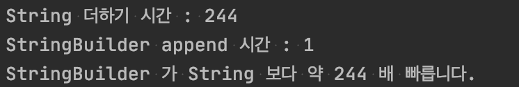

# 문자열 연결은 느리니 주의하라

## 문자열 연결 연산자 +
 - 문자열 연결 연산자로 문자열 n 개를 잇는 시간은 n^2 에 비례한다.
 - String 객체는 불변객체로, 매번 새로운 객체를 생성하게 된다.
 ```java
String A = "bla1";
String B = "bla2";

A += B;
```
 - 위 코드에서 마지막 A += B 연산은, 기존의 A 에 B 를 더하는 것이 아니다.
 - A 객체와 B 객체는 그대로 있고, A 객체와 B 객체를 복사하여 두 객체를 연결한 새로운 String 객체를 생성후,
 - A 는 그 새로운 객체를 참조한다.
 - 따라서 이 방법은 매우 효율적이지 못하다.
 - [글쓴이의 블로그에서 String, StringBuilder 자세히 보기](https://alkhwa-113.tistory.com/entry/String%EA%B3%BC-StringBuilder)
 
## 성능을 포기하고 싶지 않다면 StringBuilder 를 사용하자.

## String, StringBuilder 의 성능 비교 코드
```java
public class StringEx {

    private static final int LINE_WIDTH = 10000;
    private static final String ALPHABET = "abcdefghijklmnopqrstuvwxyz";

    public static void main(String[] args) {
        long start = System.currentTimeMillis();
        StringEx stringEx = new StringEx();
        stringEx.statement();
        long stringTime = System.currentTimeMillis() - start;
        System.out.println("String 더하기 시간 : " + stringTime);

        start = System.currentTimeMillis();
        stringEx.statement2();
        long stringBuilderTime = System.currentTimeMillis() - start;
        System.out.println("StringBuilder append 시간 : " + stringBuilderTime);

        System.out.println("StringBuilder 가 String 보다 약 " + stringTime/stringBuilderTime + " 배 빠릅니다.");
    }

    private String statement() {
        String result = "";
        for (int i = 0; i < numItems(); i++) {
            result += lineForItem();
        }
        return result;
    }

    private String statement2() {
        StringBuilder sb = new StringBuilder(LINE_WIDTH * ALPHABET.length());
        for (int i = 0; i < numItems(); i++) {
            sb.append(lineForItem());
        }
        return sb.toString();
    }

    private int numItems() {
        return LINE_WIDTH;
    }

    private String lineForItem() {
        return ALPHABET;
    }
}
```



 - 물론 문자열의 길이와 복사의 횟수에 따라 위의 결과는 바뀔 수 있다.
 - 책의 내용으로는 StringBuilder 가 String 보다 약 6배정도 빠른 결과를 냈다고 한다.
